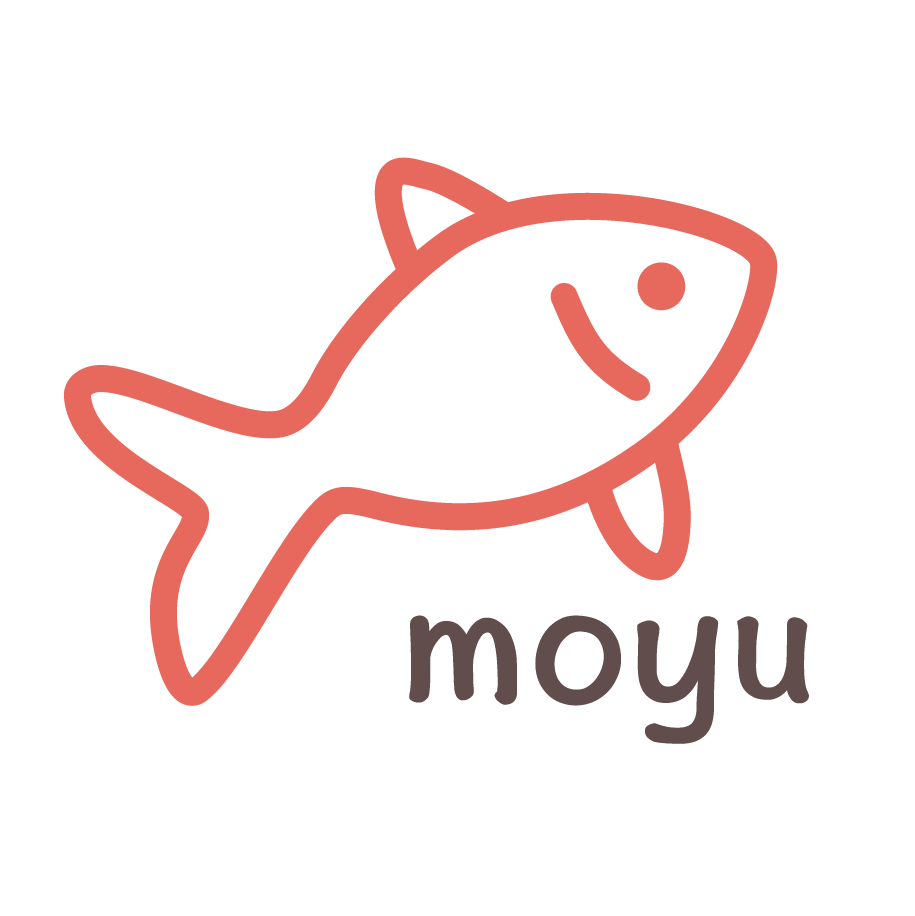

<p align="center">

</p>

# moyu

A mininal JavaScript frontend UI framework, build for fun. Still in process...

A very BETA release: https://www.npmjs.com/package/@ou-terrence/moyu <br/>

Installation:
```
npm i @ou-terrence/moyu
```

Objectives:

- [ ] Virtual DOM

  - [x] vDOM object [h.js](./packages/runtime/src/h.js)
  - [x] Mount vDOM [mount-dom.js](./packages/runtime/src/mount-dom.js)
  - [x] Destroy DOM [destroy-dom.js](./packages/runtime/src/destroy-dom.js)
  - [ ] Documentations
  - [ ] Testings

- [ ] State Management
  - [x] Dispatcher [dispatcher.js](./packages/runtime/src/dispatcher.js)
  - [x] CreateApp function
  - [ ] Documentations
  - [ ] Testings

- [ ] Reconciliation
  - [x] Array difference detection and modification sequence generation [arrays.js](./packages/runtime/src/utils/arrays.js)
  - [x] Object difference detection [objects.js](./packages/runtime/src/utils/objects.js)
  - [ ] Documentation
  - [ ] Testing [__tests__](./packages/runtime/src/__tests__/)

- [ ] Examples
  - [x] tictactoe @0.0.1
